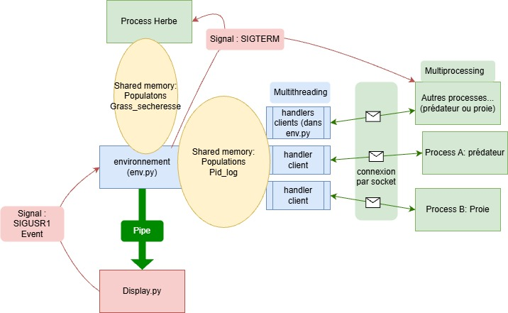

# Rapport PPC

## 1. Introduction

Ce projet s’inscrit dans le cadre du cours de Programmation Parallèle et Concurrente (PPC). Il consiste en la réalisation d’une simulation d’écosystème simplifié mettant en interaction trois types d’entités : des prédateurs, des proies et de l’herbe. Chaque entité est modélisée par un ou plusieurs processus concurrents, communiquant avec un environnement central chargé de gérer l’état global du système.

L’objectif principal du projet est de mettre en œuvre des mécanismes avancés de concurrence et de communication inter‑processus : multiprocessing, mémoire partagée, sockets, threads et signaux Unix, tout en garantissant la cohérence des données et la robustesse de l’exécution.

## 2. Conception générale et choix techniques

Le projet est structuré autour de cinq fichiers principaux : `env.py`, `proie.py`, `predateur.py`, `grass.py` et `display.py`.

Le choix central de conception a été de **centraliser l’accès à la mémoire partagée dans un unique processus**, l’environnement (`env.py`). Les autres entités (prédateurs et proies) ne modifient jamais directement l’état global : elles communiquent exclusivement via des sockets TCP. Ce choix permet :

* une séparation claire des responsabilités,
* une réduction des risques de conditions de course,
* une meilleure lisibilité de la logique métier.

Les décisions des individus sont ainsi déportées dans les processus légers (`proie.py`, `predateur.py`), tandis que les effets réels (mort, reproduction, consommation de ressources) sont validés et appliqués par l’environnement, via des threads dédiés à chaque socket client.

L’herbe constitue un cas particulier : elle est gérée par un processus unique (`grass.py`) ayant accès direct à la mémoire partagée, ce qui permet de modéliser une ressource globale évoluant indépendamment des individus.

## 3. Architecture et protocoles d’échange

### 3.1 Architecture globale

L’architecture repose sur les éléments suivants :

* **Un processus principal (`env.py`)**

  * héberge la mémoire partagée (populations, état de sécheresse),
  * lance les processus enfants,
  * démarre un serveur TCP,
  * utilise un pool de threads pour gérer les connexions.

* **Des processus clients**

  * un processus par proie,
  * un processus par prédateur,
  * un processus unique pour l’herbe.

* **Un processus d’affichage (`display.py`)**

  * reçoit les données via une `Queue`,
  * affiche l’évolution des populations en temps réel,
  * permet de déclencher des événements via des boutons.

#### Schéma conceptuel:




### 3.2 Communication par sockets

Les communications entre individus et environnement utilisent des sockets TCP locales. Chaque individu envoie des messages sérialisés avec `pickle`, de la forme :

```
[action, espece, pid]
```

Où `action` est `eats`, `reproduce` ou  `died`.

Pour chaque socket client, l’environnement crée un thread chargé de :

* recevoir les messages,
* vérifier la validité de l’action,
* modifier la mémoire partagée sous protection de verrous,
* renvoyer un message de succès ou d’échec à l’individu.

### 3.3 Utilisation des signaux

Les signaux Unix sont utilisés pour gérer des événements globaux et des arrêts propres :

* `SIGINT` : arrêt global de la simulation,
* `SIGUSR1` : déclenchement d’une sécheresse,
* `SIGTERM` / `SIGUSR2` : mort immédiate d’un processus individu.

Les individus interceptent explicitement le signal de terminaison afin d’effectuer une sortie propre sans interagir avec la mémoire partagée.

## 4. Algorithmes principaux (pseudo‑code)

### 4.1 Boucle principale de l’environnement

```
initialiser mémoire partagée
lancer herbe, proies et prédateurs
lancer affichage

TANT QUE simulation active :
    accepter nouvelles connexions
    SI signal sécheresse reçu :
        activer état sécheresse
    envoyer populations à l’affichage

arrêter serveur
terminer tous les processus enfants
```

### 4.2 Thread de gestion d’un individu

```
TANT QUE individu connecté :
    recevoir message
    SI individu mort :
        supprimer du registre
        sortir
    SI action == manger :
        tenter consommation
    SI action == reproduction :
        vérifier conditions
        créer nouveau processus si possible
    envoyer résultat à l’individu
```

### 4.3 Algorithme de décision d’une proie

```
SI énergie > seuil_haut :
    action = reproduction
SINON SI énergie < seuil_bas :
    action = manger
SINON :
    ne rien faire
```

### 4.4 Croissance de l’herbe

```
TANT QUE simulation active :
    attendre délai aléatoire
    SI pas de sécheresse :
        augmenter quantité d’herbe
    SINON :
        suspendre croissance
```

## 5. Plan de réalisation et tests

Le développement s’est déroulé de la manière suivante:

1. ajout de la communication par sockets,
2. gestion des processus individuels,
3. mise en place de la mémoire partagée et des verrous,
4. intégration des signaux,

Les tests ont été réalisés en observant, l’évolution cohérente des populations, l’absence de processus zombies et la robustesse lors de terminaisons forcées. Le tout avec des conditions initiales prédéfinies
L'interface graphique a suivi une évolution parralèle a celle du reste de la simulation, comme elle comportait ses propres challenges

## 6. Exécution et utilisation du programme

L’exécution se fait en lançant `env.py`. Le programme démarre automatiquement les entités et affiche une fenêtre graphique. L’utilisateur peut :

* observer l’évolution des populations,
* déclencher une sécheresse via un bouton,
* arrêter proprement la simulation.

L’affichage est non bloquant et fonctionne en parallèle de la simulation.

## 7. Prise de recul critique

Ce projet met en évidence la complexité de la programmation concurrente. Les principaux problèmes rencontrés concernent :

* Les defis de la non prédictabilité des signaux
* l’évitement des accès concurrents à la mémoire partagée.
* Les zombies orphelins
* le port sur linux (en effet le projet était initialement dévolppé sous windows, mais par manque de fonctionnement des signaux il a été porté sous linux)

Des améliorations possibles incluent :

* une meilleure modélisation de l’énergie,
* la posibilité de rajouter/supprimer des individus lors de la simulation
* plus généralement la possibilité d'interagir avec les individus au cours de la simulation

## 8. Conclusion

Ce projet a permis d’explorer concrètement plusieurs mécanismes fondamentaux de la programmation parallèle et concurrente. L’architecture retenue, bien que exigeante, offre une simulation robuste, modulaire et extensible, illustrant efficacement les enjeux de la concurrence dans un système distribué simplifié.
