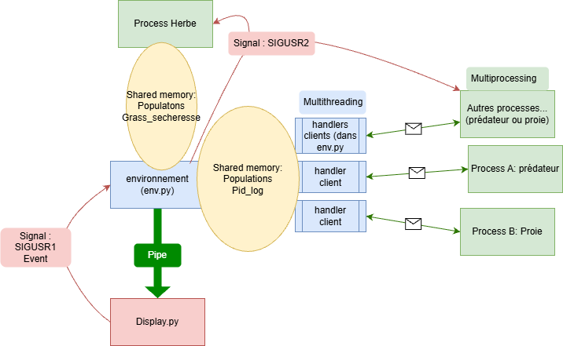

# Rapport PPC

## Rapport
Notre projet comporte 5 fichier,les quatre classiques : `env.py` `proie.py` `predateur.py` `display.py` ainsi qu'une addition afin de simplifier `env.py` : `grass.py`.
Nous avons pris une approche que l'on pourrait décrire comme spéciale dans la conception de notre projet, c'est a dire que le code permettant l'accès a la mémoire partagée se trouve entièrement dans `env.py` mais que l'appel a ces différentes fonction se fait de manière asynchrone par différent thread gérant les sockets communiquant avec les individus présents dans la simulation. Nous reviendrons plus en détail sur ceci dans les parties suivantes.

## `env.py` 
* `main()`: Notre main gère la naissance de la première génération de proie et prédateurs, ainsi que l'initialisation du programme `grass.py` (qui reçoit l'addresse de la mémoire partagée). Chaque individu d'une espèce est un Process différent. (sauf herbe, il n'y a qu'un seul process Herbe)
De plus, il initialise la communication par signaux, et gère les signaux qu'il serait suceptible de reçevoir (depuis le display par exemple)
Le main initialise aussi la mémoire partagée qui sera utilisée par les autres programmes.
Enfin, il y a une boucle dans le main qui, tant que la simulation n'est pas indiquée comme finie, gère et accepte les nouveaux individus dans la simulation. (sous la forme de connexion a travers des sockets.)
* handling des signaux: Le programme est conçu pour recevoir et traiter différement 2 signaux : ``SIGINT`` quand on essaye d'interrompre ``SIGUSR1`` pour traiter l'evènement de secheresse 
* le Programme est conçu pour envoyer Le ``SIGUSR2`` a ses enfants pour déclencher leur mort douce et sans erreur.
* Communication par socket: A chaque initialisation de Process enfants, une communication par socket est activée, elle permettra a l'enfant de faire passer de messages concernant son état et ses décisions au fil du temps. chaque socket est géré par un thread différent.

## `predateur.py` (et `proie.py`)
Les deux programmes fonctionnent de manière quasiment identique, a la différence près qu'ils n'envoient pas les mêmes messages.
Les messages sont envoyés sous la forme suivante `[action, espèce, pid]` a travers la communication vers l'environnement,pour la pluspart des messages, une réponse contenant le succès éventuel de l'action est nécessaire (sauf pour le message : "je suis mort") , c'est le thread de l'environnement correspondant qui se chargera d'acceder a la mémoire, d'effectuer l'action,et d'informer l'individu de la réussite ou non de celle ci.
Le code inclu aussi un handler du signal ``SIGUSR2``, qui lui permet de déclencher sa mort de manière propre

## `grass.py`
grass fonctionne de manière significativemet différente, il est appelé comme process fils de l'environnement et fonctionne en agissant directement sur la mémoire partagée, prend en charge les secheressses, et l'arrêt soft

## `display.py`
* `display()` : La fonction gérant l'affichage des courbes représentant les populations ainsi que des boutons d'arrêt du programme et d'évennement de sécheresse.
  La fonction commence par créer les courbes puis les affiche au fur et à mesure en adaptant les axes et en récupérant les données envoyées par `env.py` par le biais d'une Queue. Les données sont triées par secondes et lorsqu'un nouveau message arrive, il remplace la valeur se trouvant en bout de liste au moment de la réception. On met ensuite à jour le tracé.
  On crée ensuite deux bouttons, `quit` et `event` :
    * `quit` active un event qui conditionne la fin du programme dans `env.py`. Le choix de l'utilisation d'un event à la place d'un signal ici nous permet de contrôller le moment où l'information arrive dans l'exécution du programme.
    * `event` envoie un signal, ``SIGUSR1``, au programme principal pour déclencher l'évenement de sécheresse. Ce signal ne fonctionne que sous linux, windows ne permettant d'utiliser que ``SIGINT`` sans causer de problème et celui-ci étant déjà utilisé.

## Schéma conceptuel:

